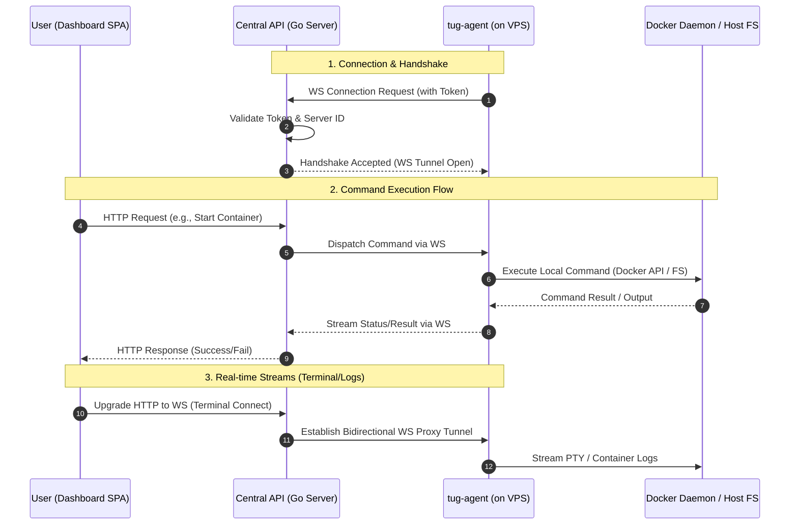

# ⚓️ tug-agent — The Heart of Your VPS

Hey there! Meet **tug-agent** — the silent, hard-working, and extremely agile agent running directly on your VPS. It's the one doing all the heavy lifting: managing Docker containers, keeping the file sandbox secure, streaming the terminal, and making sure your apps run smoothly.

Best of all — it is completely **stateless**. The entire state is kept securely in the tug.sh cloud, so if anything goes wrong, you can just spin up a new agent and keep rolling!

---

## 🚀 Key Features

*   🐳 **Docker Control Room** — spins up, stops, restarts containers, and streams logs.
*   📦 **Docker Compose Support** — deploys full stacks from your compose files.
*   🔒 **Secure Sandbox** — keeps all project files isolated in `/var/lib/tug/apps`.
*   📟 **Real-time Terminal** — fast, secure PTY streaming straight to your browser via WebSockets.
*   🔄 **Autoupdate** — keeps itself fresh with the latest updates and patches (see `updater.go`).
*   🧹 **Clean Uninstall** — one command and it vanishes from the server without leaving any clutter.

---

## 🛠️ CLI Cheat Sheet

You control the agent with positional commands (`tug` or `tug-agent`):

### 1. Start Service / Connect
Forces starting the agent service in the background. If no configuration exists, initiates a new connection setup:
```bash
tug start
```

### 2. Initialization (First Run)
Generates a unique connection token and a dashboard link to pair your VPS:
```bash
tug init
```

### 3. Status Check
Check if the agent is active, its version, and connection status:
```bash
tug status
```

### 4. Version Check
Check current agent version:
```bash
tug version
```

### 5. Stop Service
Politely stops the systemd service:
```bash
tug stop
```

### 6. Restart Service
Restarts the systemd service (`systemctl restart tug-agent`):
```bash
tug restart
```

### 7. Logs
Prints the last 100 lines of `agent.log`. Pass a number to change the limit:
```bash
tug logs
tug logs 250
```

### 8. Disconnect
Clears connection tokens and configuration. Useful if you want to pair the VPS with another account:
```bash
tug disconnect
```

### 9. Uninstall (Remove)
Removes the agent from the system, cleans up systemd files, and sweeps the floor:
```bash
tug remove
```

---

## ⚙️ Configuration (`agent.env`)

The agent looks for environment variables in the following order:
1. Path specified in the `TUG_AGENT_ENV_PATH` environment variable.
2. `/etc/tug/agent.env` (default production path).
3. `./agent.env` (local file in the current working directory).

A typical config file looks like this:
```env
# Token generated during initialization
TUG_AGENT_TOKEN=agtv2.c3J2X3Rlc3Q.xyz...
# Log verbosity: debug | info | warn | error (defaults to debug while TUG_VERBOSE=true)
TUG_LOG_LEVEL=info

# Edge router (tug-router) installation, all optional
TUG_ROUTER_IMAGE=caddy:2
TUG_ROUTER_HTTP_PORT=80
TUG_ROUTER_HTTPS_PORT=443
TUG_ROUTER_CONFIG_PATH=/etc/caddy/Caddyfile
TUG_ROUTER_NETWORK=
```

---

## 💻 Developer Guide (Time to tinker!)

If you want to hack on the agent locally:

1. **Prerequisites**: Go 1.21+ and Docker installed on your test machine.
2. **Build the binary**:
   ```bash
   go build -o tug-agent ./cmd/agent
   ```
3. **Run daemon locally**:
   ```bash
   ./tug-agent run
   ```
4. **Run the test suite** (no docker daemon or network required):
   ```bash
   go test ./...
   go test -race ./...
   ```

Tests cover the logic that can break silently: sandbox path confinement, config
bounds, the durable event queue and its restart behaviour, ack handling and
container delta de-duplication, router route conflicts and Caddyfile rendering,
compose file resolution and reconnect backoff. Code that only shells out to
`docker` or `systemctl` is verified through its argument building, not by
invoking the daemon.

### Package layout
Each package owns one concern and depends only on the packages below it:

| Package | Responsibility |
| --- | --- |
| `internal/agent` | Orchestration: session (`session.go`), handshake snapshot (`handshake.go`), event queue integration (`events.go`), command lifecycle (`command_dispatch.go`, `command_inbox.go`), command handlers (`commands*.go`), terminals and git deploys |
| `internal/protocol` | Wire contract: handshake, commands, results, event envelopes (`envelope.go`) and the durable event queue (`queue.go`) |
| `internal/docker` | Generic docker CLI wrapper: containers, compose, networks, disk usage |
| `internal/router` | The edge reverse proxy container and its routes |
| `internal/sandbox` | Data directory plus every path-confined file operation |
| `internal/lifecycle` | The agent's own binary: self update and uninstall |
| `internal/logging` | Leveled logger and operation transcripts |
| `internal/shell` | Runs host processes and records their output in a transcript |
| `internal/system` | Host CPU, RAM and disk metrics |
| `internal/config` | Environment configuration with bounds and defaults |

### Architecture in 5 Sentences:
Upon startup, the agent loads its configuration and sends a handshake snapshot to the central API (`internal/agent/handshake.go`). Once the handshake succeeds, the session loop listens for incoming frames (`internal/agent/session.go`) while background loops send heartbeats and flush the durable event queue (`internal/agent/events.go`). When a command arrives, the runtime looks it up in the command registry (`commands.go`) and calls the matching handler in `commands_docker.go`, `commands_router.go`, `commands_files.go` or `commands_system.go`. Project files are isolated within a dedicated sandbox directory (`internal/sandbox`). All operations are written to `agent.log` using rolling log rotation to prevent disk space issues.

### Managed containers
`internal/docker` only exposes generic primitives (`RunContainer`, `RemoveContainer`, `CopyToContainer`, `ExecInContainer`, `FindContainerNameByLabel`, `EnsureNetwork`) and knows nothing about specific images. Anything platform specific lives in its own component: the reverse proxy is `internal/router`, driven by a `router.Spec` built from the `TUG_ROUTER_*` variables. Adding another managed container means adding a component with its own spec, not editing `internal/docker`.

### Logging & wire types
- Diagnostics go through the single leveled logger in `internal/logging` (`[debug] / [info] / [warn] / [error]`); no component calls the standard `log` package directly.
- Command transcripts returned to the dashboard are collected with `logging.Transcript`, which can mirror lines into the agent log for long running operations.
- Websocket message structs live in `internal/protocol`, error markers in `internal/agent/errors.go`, so behaviour files stay free of type declarations.

### 🔄 Data & Communication Flow



Happy coding! 🚢
