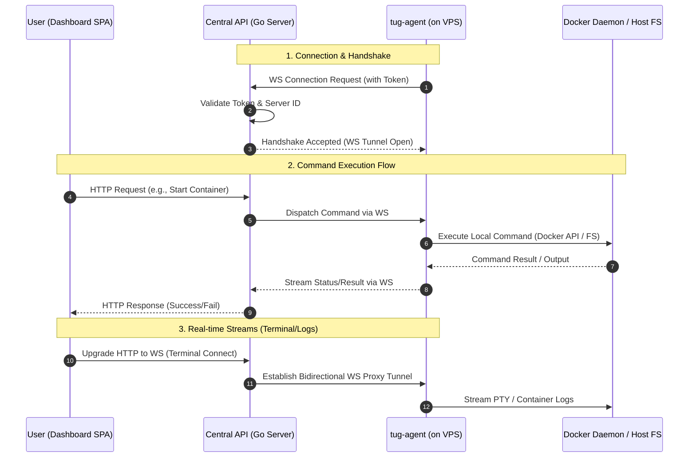

# ⚓️ tug-agent — The Heart of Your VPS

Hey there! Meet **tug-agent** — the silent, hard-working, and extremely agile agent running directly on your VPS. It's the one doing all the heavy lifting: managing Docker containers, keeping the file sandbox secure, streaming the terminal, and making sure your apps run smoothly.

Best of all — it is completely **stateless**. The entire state is kept securely in the tug.sh cloud, so if anything goes wrong, you can just spin up a new agent and keep rolling!

---

## 🚀 Key Features

*   🐳 **Docker Control Room** — spins up, stops, restarts containers, and streams logs.
*   📦 **Docker Compose Support** — deploys full stacks from your compose files.
*   🔒 **Secure Sandbox** — keeps all project files isolated in `/var/lib/tug/apps`.
*   📟 **Real-time Terminal** — fast, secure PTY streaming straight to your browser via WebSockets.
*   🔄 **Autoupdate** — keeps itself fresh with the latest updates and patches (see `updater.go`).
*   🧹 **Clean Uninstall** — one command and it vanishes from the server without leaving any clutter.

---

## 🛠️ CLI Cheat Sheet

You control the agent using CLI flags or positional sub-commands (invokable as `tug` or `tug-agent`):

### 1. Start Service / Connect
Forces starting the agent service in the background. If no configuration exists, initiates a new connection setup:
```bash
tug start
# or:
tug --start
```

### 2. Initialization (First Run)
Generates a unique connection token and a dashboard link to pair your VPS:
```bash
tug init
# or:
tug --init
```

### 3. Status Check
Check if the agent is active, its version, and connection status:
```bash
tug status
# or:
tug --status
```

### 4. Version Check
Check current agent version (v1.0.2):
```bash
tug version
# or:
tug --version
```

### 5. Stop Service
Politely stops the systemd service:
```bash
tug stop
# or:
tug --stop
```

### 6. Disconnect
Clears connection tokens and configuration. Useful if you want to pair the VPS with another account:
```bash
tug disconnect
# or:
tug --disconnect
```

### 7. Uninstall (Remove)
Removes the agent from the system, cleans up systemd files, and sweeps the floor:
```bash
tug remove
# or:
tug --remove
```

---

## ⚙️ Configuration (`agent.env`)

The agent looks for environment variables in the following order:
1. Path specified in the `TUG_AGENT_ENV_PATH` environment variable.
2. `/etc/tug/agent.env` (default production path).
3. `./agent.env` (local file in the current working directory).

A typical config file looks like this:
```env
# Token generated during initialization
TUG_AGENT_TOKEN=agtv2.c3J2X3Rlc3Q.xyz...
```

---

## 💻 Developer Guide (Time to tinker!)

If you want to hack on the agent locally:

1. **Prerequisites**: Go 1.21+ and Docker installed on your test machine.
2. **Build the binary**:
   ```bash
   go build -o tug-agent ./cmd/agent
   ```
3. **Run with verbose logs**:
   ```bash
   ./tug-agent --verbose
   ```

### Architecture in 5 Sentences:
Upon startup, the agent loads its configuration and attempts a WebSocket connection handshake with the central API (`internal/agent/handshake.go`). Once the handshake succeeds, the agent enters a runtime loop listening for incoming commands (`internal/agent/runtime.go`). When a task arrives (e.g., container action or file edit), the agent dispatches it to the corresponding internal module (`docker.go`, `file_manager.go`, `terminal.go`). Project files are isolated within a dedicated sandbox directory (`sandbox.go`). All operations are written to `agent.log` using rolling log rotation to prevent disk space issues.

### 🔄 Data & Communication Flow



Happy coding! 🚢
